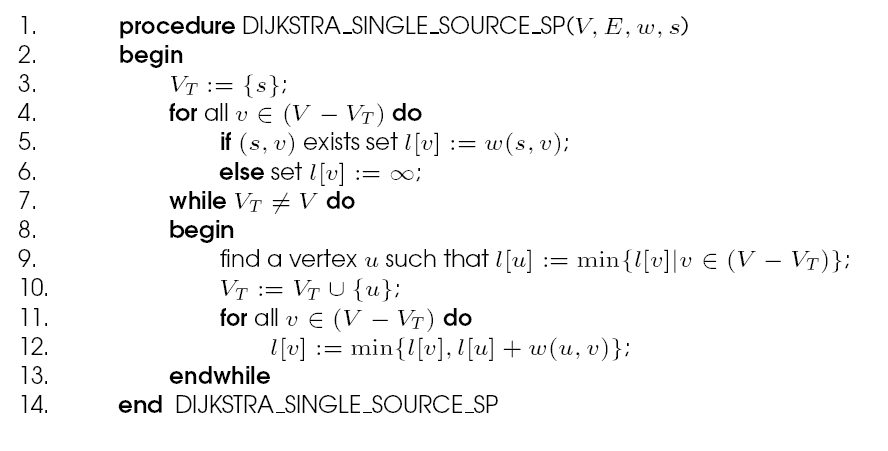
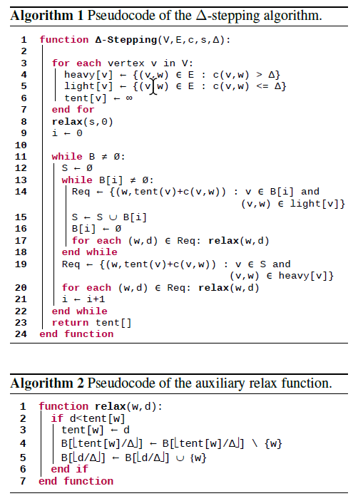
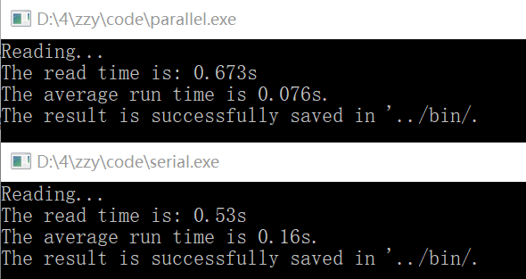
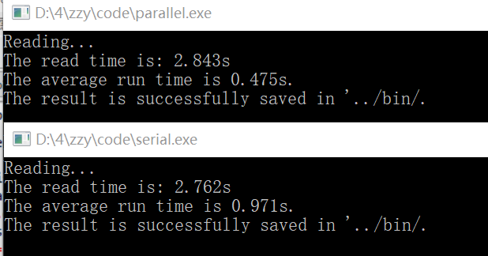
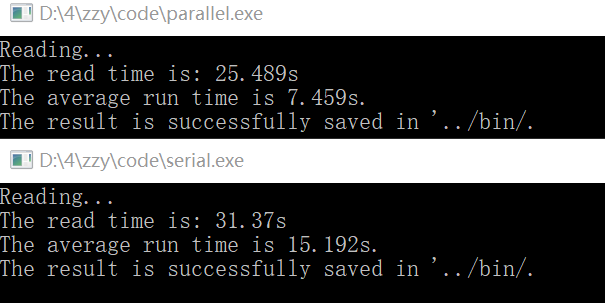

# delta-stepping
并行与分布式计算导论大作业

**单源最短路径算法（SSSP）的探究**

**问题描述**

对在权图G=(V,E)，从一个源点s到汇点t有很多路径，其中路径上权和最少的路径，称从s到t的最短路径。求从源点s到其它所有点的最短路径问题，即SSSP。

**数据集**

CTR，NE，NY，from http://users.diag.uniroma1.it/challenge9/format.shtml

- Graph (.gr files)
- Problem specification files (.ss files)
- Performance report files (.ss.res files)
- Correctness checking files (.ss.chk files)

**文件描述**

bin：存放脚本和可执行程序。其中parallel和serial是串并行的程序，check后缀的是他们检查正确结果的程序；genUSA-road.ss.pl生成随机源点，genSources.pl是前者的附属脚本无需使用，runUSA-road-d(t).ss.pl用来运行可执行程序。

code：存放源码。分别是bin中四个可执行文件的c++源码。

data：存放数据集.gr文件和源点.ss文件。

report：存放报告和使用方法。

**使用方法**

1.(可选)运行bin文件夹里的genUSA-road.ss.pl脚本，会在data文件夹里生成三个数据集对应的随机源点文件(.ss)。如果不想使用它生成的，可以把其他的.ss文件放到这个文件夹里，名字得相同。

2.如果要测试单个程序在单个数据集上的运行结果，可以直接运行bin文件夹中的parallel(-check)、serial(-check)可执行程序，然后它的两个参数分别是数据集的地名和d/t。比如命令./parallel.exe NY d，就是用并行算法程序，去计算USA-road-d.NY这个数据集。

3.如果要测试一个程序在所有数据集上的运行结果，可以使用bin文件夹中的runUSA-road-d(t).ss.pl脚本，他就会用SOLVE参数指定的程序，分别在三个数据集上运行。想要修改调用的程序，只需修改脚本里的SOLVE参数。

4.生成的.res和.chk文件都存放在bin文件夹中，分别记录了运行时间和最短路径总长度(模2\^62)。

**算法介绍**

**1.Dijkstra算法**

迪杰斯特拉算法(Dijkstra)是由荷兰计算机科学家Dijkstra于1959 年提出的，解决的是有权图中最短路径问题。Dijkstra算法主要特点是以起始点为中心向外层层扩展，直到扩展到终点为止。

Dijkstra的原始算法的时间复杂度为O (\| V \|**^2^**)，基于Fibonacci堆实现优先队列的优化算法可以达到O (\| E \| + \| V \| log \| V \|)。对于具有无界非负权重的任意有向图，这是趋近于最快的已知的单源最短路径算法。

算法伪代码如下：

**2.△-Stepping算法**

△-Stepping算法由U. Meyer和P. Sanders在2003年的论文里提出。算法结合了Dijkstra和Bellman-Ford算法的思想，引入了"桶"和△的概念，把边与△相比分为heavy和light两类，把所有顶点按到源点距离大小放入不同的桶里。该算法从第一个非空桶中移除所有节点，并从这些节点中松弛所有light边，这可能导致进入当前桶的新节点在下一阶段被删除。此外，如果先前阶段已经改善了它们的距离，则可以重新插入从该桶中删除的节点。此时不需要松弛heavy边，因为它们不会将节点插入当前桶中。一旦当前桶在一个阶段后最终保持为空，则已为其内的所有节点分配了它们的最终距离值。

△-Stepping算法能达到O(n + m + d · L)的时间复杂度(n、m是顶点数和边数，d是最大度数，L是源点到其他点最短路径中的最大值)，十分高效，同时又允许实现有效的并行化。

算法伪代码如下：

**算法实现**

**1.Dijkstra算法**

首先，面对如此大的数据规模，肯定得用邻接表存储图。其次为了程序比O(\| V \|**^2^**)更快，必须考虑添加一些优化。总时间复杂度=找最短距离+更新距离，因此在找最短距离这个阶段可以用堆来优化达到logV级别。至于堆，具体有STL、二叉堆、斐波那契堆等实现方式，差别对于稀疏图不是很大(常数级)，这里就简单地使用了现成的STL的优先队列。事实上结果是满意的，优化后比SPFA等算法表现好，这也是选择这个串行算法的原因。

**2.△-Stepping算法**

第一次接触△-Stepping算法，因此只是简单复现了一下论文给的算法。最关键的Bucket数组B\[i\]，采用容器数组的方式存储；算法中出现的Req、S也都是用容器存储顶点。除了△-Stepping的主要循环作为一个函数，还有relax函数实现边的松弛操作，以及单独为循环写了个函数，判断整个bucket是否空（在relax时记录下最大的桶数，然后每次只看这么多桶是否全空）。

用OpenMP实现并行算法。不难看出，图2的14、17、19、20行数据无依赖关系，都是可以并行的，也就是算法中取出节点形成Req数组、对它们松弛的操作都可以并行，都是简单的for并行化。

此外还有△参数的选择。通过调试发现，随着△的增大，运行时间是先变短再变长的，确实符合Dijkstra和Bellman-Ford的一个折中，因此也对于每个数据集，设置了不同的适中的△值。

通过本机上运行程序可以看到，在NY、NE、CTR三个数据集上，delta-stepping相比优化后的Dijkstra还是快了不少，如果不看读写时间，几乎是两倍了。

**作业总结&感想**

这次期末大作业让我受益匪浅。不仅了解了单源最短路径问题的不同算法和串并行优化，并且通过亲身实践，对于其中的两种关键算法有了更深的了解，同时也锻炼了阅读文献、自主学习和动手编程的能力。说实话，作为非信科的低年级同学学习这门课是有一些困难，调试的种种bug，一开始对于服务器和linux环境下操作的一头雾水，但慢慢摸索和学习的过程是美妙的，最后看到成果的雏形一点点出现也是很欣喜的。
